# SISTEM PARALLEL DAN TERDISTRIBUSI

# Implementasi Distributed Synchronization System

---

## Identitas

Nama: Muhammad Aldri Saputra  
NIM: 11231050  
Mata Kuliah: Sistem Parallel dan Terdistribusi  
Judul Tugas: Implementasi Distributed Synchronization System  
Jenis Tugas: Tugas Individu

---

## 1. Abstrak

Distributed system merupakan sistem yang terdiri dari beberapa node yang saling berkomunikasi untuk menjalankan suatu proses secara bersama-sama. Salah satu tantangan utama dalam distributed system adalah menjaga konsistensi data, sinkronisasi antar node, serta menangani kegagalan seperti node failure dan network partition.

Pada tugas ini, dibuat sebuah sistem bernama Distributed Synchronization System. Sistem ini mensimulasikan tiga node yang saling berkomunikasi dan menjalankan beberapa fitur utama, yaitu Distributed Lock Manager, Distributed Queue, dan Distributed Cache Coherence.

Distributed Lock Manager menggunakan simplified Raft Consensus untuk menentukan leader dan mereplikasi operasi lock. Distributed Queue menggunakan consistent hashing untuk menentukan owner queue, serta Redis sebagai penyimpanan message. Distributed Cache menggunakan protokol MESI untuk menjaga konsistensi cache antar node.

Sistem ini juga dijalankan menggunakan Docker Compose agar setiap komponen seperti Redis, node1, node2, dan node3 dapat berjalan secara bersamaan. Pengujian dilakukan menggunakan command API dan Locust untuk melihat performa sistem pada beberapa skenario jumlah user.

---

## 2. Pendahuluan

Sistem parallel dan terdistribusi memiliki peran penting dalam pengembangan aplikasi modern. Banyak sistem saat ini tidak hanya berjalan pada satu mesin, tetapi pada beberapa mesin atau node yang saling bekerja sama.

Dalam distributed system, beberapa masalah utama yang sering muncul adalah sinkronisasi, konsistensi data, komunikasi antar node, failure handling, dan performa sistem. Oleh karena itu, dibutuhkan mekanisme tertentu agar node-node dalam sistem dapat tetap bekerja secara konsisten.

Tugas ini berfokus pada implementasi sistem sinkronisasi terdistribusi. Sistem yang dibuat terdiri dari tiga node utama. Masing-masing node dapat menjalankan fungsi lock manager, queue, cache, serta ikut dalam proses leader election menggunakan Raft Consensus.

---

## 3. Tujuan

Tujuan dari pembuatan sistem ini adalah:

1. Mengimplementasikan Distributed Lock Manager dengan dukungan shared lock dan exclusive lock.
2. Mengimplementasikan simplified Raft Consensus untuk leader election dan log replication.
3. Mengimplementasikan deadlock detection menggunakan wait-for graph.
4. Mengimplementasikan Distributed Queue menggunakan consistent hashing.
5. Menyediakan message persistence dan at-least-once delivery menggunakan Redis.
6. Mengimplementasikan Distributed Cache Coherence menggunakan protokol MESI.
7. Mengimplementasikan LRU replacement policy pada cache lokal.
8. Menjalankan sistem menggunakan Docker dan Docker Compose.
9. Melakukan pengujian fitur dan performance testing menggunakan Locust.

---

## 4. Teknologi yang Digunakan

Teknologi yang digunakan dalam project ini adalah:

- Teknologi - Keterangan

---

- Python 3.11 - Bahasa pemrograman utama
- asyncio - Menangani proses asynchronous
- aiohttp - Membuat HTTP server dan komunikasi antar node
- Redis - Penyimpanan queue dan cache backing store
- Docker - Containerization
- Docker Compose - Orchestration beberapa service
- Locust - Load testing dan performance benchmark
- PowerShell - Pengujian API secara lokal

---

## 5. Arsitektur Sistem

Sistem terdiri dari tiga node utama, yaitu `node1`, `node2`, dan `node3`. Setiap node menjalankan service Python berbasis `aiohttp` dan dapat saling berkomunikasi melalui HTTP.

Selain tiga node tersebut, sistem juga menggunakan Redis. Redis digunakan sebagai penyimpanan tambahan untuk Distributed Queue dan Distributed Cache.

Secara umum, komponen sistem terdiri dari:

- `node1`, berjalan pada port 8001
- `node2`, berjalan pada port 8002
- `node3`, berjalan pada port 8003
- Redis, berjalan pada port 6379

Setiap node memiliki komponen berikut:

1. Raft Consensus
2. Distributed Lock Manager
3. Distributed Queue Node
4. Distributed Cache Node
5. Metrics endpoint

Alur umum sistem adalah sebagai berikut:

1. Client mengirim request ke salah satu node.
2. Node memproses request sesuai fitur yang digunakan.
3. Untuk operasi lock, request harus diproses oleh leader Raft.
4. Untuk queue, owner queue ditentukan menggunakan consistent hashing.
5. Untuk cache, data disimpan pada cache lokal dan Redis backing store.
6. Node saling berkomunikasi untuk heartbeat, log replication, queue forwarding, dan cache invalidation.

---

## 6. Implementasi Raft Consensus

Raft Consensus digunakan untuk memilih leader di antara tiga node. Pada awalnya setiap node berada pada state follower. Jika follower tidak menerima heartbeat dari leader dalam waktu tertentu, maka node dapat berubah menjadi candidate dan memulai election.

State dalam Raft:

- follower
- candidate
- leader

Alur Raft yang digunakan:

1. Semua node mulai sebagai follower.
2. Jika timeout terjadi, node berubah menjadi candidate.
3. Candidate meminta vote dari node lain.
4. Jika mendapatkan mayoritas vote, candidate berubah menjadi leader.
5. Leader mengirim heartbeat ke follower secara berkala.
6. Operasi lock diproses oleh leader dan direplikasi ke follower.

Dalam pengujian, sistem berhasil memilih satu node sebagai leader dan dua node lainnya sebagai follower.

Contoh hasil:

```text
node1 = leader
node2 = follower
node3 = follower
```

Jika request lock dikirim ke follower, sistem akan menolak request tersebut dan mengembalikan informasi `leader_id`.

---

## 7. Implementasi Distributed Lock Manager

Distributed Lock Manager digunakan untuk mengatur akses client terhadap resource tertentu.

Jenis lock yang didukung:

1. Shared lock
2. Exclusive lock

Shared lock dapat digunakan oleh lebih dari satu client secara bersamaan selama tidak ada exclusive lock pada resource tersebut.

Exclusive lock hanya dapat digunakan oleh satu client dan tidak boleh ada shared lock aktif pada resource yang sama.

Aturan lock yang digunakan:

- Shared lock boleh dimiliki banyak client.
- Exclusive lock hanya boleh dimiliki satu client.
- Exclusive lock tidak dapat diberikan jika masih ada shared lock.
- Shared lock tidak dapat diberikan jika resource sedang dikunci exclusive oleh client lain.
- Operasi lock harus diproses melalui leader Raft.

Endpoint utama:

```text
POST /lock/acquire
POST /lock/release
GET  /lock/status
```

Contoh pengujian shared lock menunjukkan bahwa dua client dapat mengambil shared lock pada resource yang sama.

Contoh pengujian exclusive lock menunjukkan bahwa exclusive lock gagal diberikan ketika shared lock masih aktif.

---

## 8. Deadlock Detection

Deadlock detection diimplementasikan menggunakan wait-for graph.

Wait-for graph menyimpan hubungan antar client yang sedang saling menunggu resource.

Contoh skenario:

1. `client-X` memegang `deadlock-X`.
2. `client-Y` memegang `deadlock-Y`.
3. `client-X` mencoba mengambil `deadlock-Y`.
4. `client-Y` mencoba mengambil `deadlock-X`.

Kondisi tersebut menghasilkan siklus:

```text
client-X -> client-Y -> client-X
```

Jika siklus ditemukan, sistem mengembalikan response:

```json
{
  "success": false,
  "reason": "deadlock detected"
}
```

Hasil pengujian menunjukkan bahwa sistem berhasil mendeteksi deadlock. Pada endpoint `/lock/status`, field `deadlock_detected` bernilai `true`.

---

## 9. Implementasi Distributed Queue

Distributed Queue digunakan untuk menangani producer dan consumer secara terdistribusi.

Sistem menggunakan consistent hashing untuk menentukan node owner dari sebuah queue. Jika request dikirim ke node yang bukan owner, request akan diteruskan ke owner queue yang benar.

Redis digunakan untuk menyimpan data queue. Dengan menggunakan Redis, message tidak hanya tersimpan pada memory lokal node.

Komponen queue:

- ready queue
- processing queue
- queue metrics

Alur enqueue:

1. Producer mengirim message ke node.
2. Sistem menentukan owner queue menggunakan consistent hashing.
3. Owner queue menyimpan message ke Redis ready queue.

Alur dequeue:

1. Consumer meminta message.
2. Message diambil dari ready queue.
3. Message dipindahkan ke processing queue.
4. Consumer menerima message.

Alur ACK:

1. Consumer selesai memproses message.
2. Consumer mengirim ACK.
3. Message dihapus dari processing queue.

At-least-once delivery dicapai karena message tidak langsung hilang saat diambil consumer. Message baru dihapus setelah consumer mengirim ACK.

Endpoint utama:

```text
POST /queue/enqueue
POST /queue/dequeue
POST /queue/ack
POST /queue/recover
GET  /queue/status
```

Hasil pengujian menunjukkan bahwa enqueue, dequeue, dan ACK berhasil berjalan.

---

## 10. Implementasi Distributed Cache Coherence

Distributed Cache Coherence digunakan agar cache pada beberapa node tetap konsisten.

Protocol yang digunakan adalah MESI.

State MESI:

## State - Keterangan

M - Modified, data sudah dimodifikasi pada cache lokal
E - Exclusive, data hanya dimiliki oleh satu node
S - Shared, data dibaca oleh lebih dari satu node
I - Invalid, data cache sudah tidak valid-

Redis digunakan sebagai backing store. Cache lokal digunakan untuk mempercepat akses baca.

Alur write cache:

1. Client menulis data ke salah satu node.
2. Node menyimpan data ke Redis.
3. Node menyimpan data ke cache lokal dengan state `M`.
4. Node mengirim invalidation ke node lain.
5. Node lain menandai cache sebagai `I`.

Alur read cache:

1. Jika data ada di cache lokal dan valid, maka terjadi cache hit.
2. Jika data tidak ada atau invalid, maka node mengambil data dari Redis.
3. Data dari Redis disimpan kembali ke cache lokal.

Sistem juga menggunakan LRU replacement policy. Kapasitas cache lokal dibatasi. Jika jumlah data melebihi kapasitas, data yang paling lama tidak digunakan akan dikeluarkan.

Endpoint utama:

```text
POST   /cache/{key}
GET    /cache/{key}
DELETE /cache/{key}
GET    /cache/status
GET    /metrics
```

Hasil pengujian menunjukkan:

- cache write menghasilkan state `M`,
- read pertama dari node lain menghasilkan cache miss,
- read kedua menghasilkan cache hit,
- update data mengubah cache node lain menjadi state `I`,
- LRU eviction berjalan ketika kapasitas cache penuh.

---

## 11. Containerization

Sistem dijalankan menggunakan Docker dan Docker Compose.

Service yang dijalankan:

## Service - Port

Redis - 6379
node1 - 8001
node2 - 8002
node3 - 8003

File Docker yang digunakan:

```text
docker/Dockerfile.node
docker/docker-compose.yml
```

Command untuk menjalankan sistem:

```bash
docker compose -f docker/docker-compose.yml up --build
```

Hasil pengujian menggunakan `docker ps` menunjukkan bahwa seluruh container berhasil berjalan, yaitu:

- distributed-redis
- distributed-node1
- distributed-node2
- distributed-node3

Dengan Docker Compose, semua komponen sistem dapat dijalankan secara bersamaan dalam satu network.

---

## 12. Pengujian Sistem

Pengujian dilakukan untuk memastikan bahwa semua fitur berjalan sesuai requirement. Pengujian dilakukan melalui terminal PowerShell dengan mengakses endpoint API pada node yang berjalan menggunakan Docker Compose.

Pengujian mencakup beberapa bagian utama, yaitu Docker container, Raft leader election, distributed lock, deadlock detection, network partition, distributed queue, distributed cache coherence, cache invalidation, dan LRU eviction.

---

### 12.1 Pengujian Docker

Pengujian Docker dilakukan untuk memastikan bahwa semua service berhasil berjalan dalam container.

Command yang digunakan:

```bash
docker ps
```

Hasil pengujian menunjukkan bahwa Redis, node1, node2, dan node3 berjalan dengan status aktif.

Container yang berjalan:

- `distributed-redis`
- `distributed-node1`
- `distributed-node2`
- `distributed-node3`

Screenshot: `01_docker_containers_running.png`

---

### 12.2 Pengujian Raft Leader Election

Pengujian Raft dilakukan untuk memastikan bahwa cluster dapat memilih satu leader dan dua follower.

Endpoint yang digunakan:

```text
GET /raft/status
```

Pengujian dilakukan pada node1, node2, dan node3.

Command yang digunakan:

```powershell
Invoke-RestMethod http://127.0.0.1:8001/raft/status
Invoke-RestMethod http://127.0.0.1:8002/raft/status
Invoke-RestMethod http://127.0.0.1:8003/raft/status
```

Hasil pengujian menunjukkan bahwa terdapat satu node sebagai leader dan dua node sebagai follower. Hal ini membuktikan bahwa proses leader election pada Raft berhasil berjalan.

Screenshot: `02_raft_leader_follower.png`

---

### 12.3 Pengujian Shared Lock

Pengujian shared lock dilakukan untuk memastikan bahwa lebih dari satu client dapat mengambil shared lock pada resource yang sama.

Resource yang digunakan adalah:

```text
docker-file-A
```

Client yang digunakan:

- `client-1`
- `client-2`

Command untuk client-1:

```powershell
Invoke-RestMethod -Method Post http://127.0.0.1:8001/lock/acquire `
  -ContentType "application/json" `
  -Body '{"resource":"docker-file-A","client_id":"client-1","lock_type":"shared"}'
```

Command untuk client-2:

```powershell
Invoke-RestMethod -Method Post http://127.0.0.1:8001/lock/acquire `
  -ContentType "application/json" `
  -Body '{"resource":"docker-file-A","client_id":"client-2","lock_type":"shared"}'
```

Hasil pengujian menunjukkan bahwa `client-1` dan `client-2` berhasil mendapatkan shared lock pada resource yang sama. Hal ini membuktikan bahwa shared lock dapat digunakan oleh lebih dari satu client secara bersamaan.

Screenshot:

- `03a_shared_lock_client1_success.png`
- `03b_shared_lock_client2_success.png`

---

### 12.4 Pengujian Exclusive Lock Conflict

Pengujian exclusive lock conflict dilakukan untuk memastikan bahwa exclusive lock tidak dapat diberikan ketika resource masih digunakan oleh shared lock.

Command yang digunakan:

```powershell
try {
  Invoke-RestMethod -Method Post http://127.0.0.1:8001/lock/acquire `
    -ContentType "application/json" `
    -Body '{"resource":"docker-file-A","client_id":"client-3","lock_type":"exclusive"}'
} catch {
  $_.ErrorDetails.Message
}
```

Hasil pengujian menunjukkan bahwa sistem menolak request exclusive lock karena resource masih digunakan oleh client lain.

Contoh response:

```json
{
  "success": false,
  "resource": "docker-file-A",
  "client_id": "client-3",
  "lock_type": "exclusive",
  "reason": "lock is currently held by another client"
}
```

Screenshot: `04_exclusive_lock_conflict.png`

---

### 12.5 Pengujian Deadlock Detection

Pengujian deadlock detection dilakukan dengan membuat dua client saling menunggu resource.

Skenario yang digunakan:

1. `client-X` memegang resource `deadlock-X`.
2. `client-Y` memegang resource `deadlock-Y`.
3. `client-X` mencoba mengambil resource `deadlock-Y`.
4. `client-Y` mencoba mengambil resource `deadlock-X`.

Kondisi tersebut membentuk siklus pada wait-for graph:

```text
client-X -> client-Y -> client-X
```

Command awal untuk mengambil lock:

```powershell
Invoke-RestMethod -Method Post http://127.0.0.1:8001/lock/acquire `
  -ContentType "application/json" `
  -Body '{"resource":"deadlock-X","client_id":"client-X","lock_type":"exclusive"}'
```

```powershell
Invoke-RestMethod -Method Post http://127.0.0.1:8001/lock/acquire `
  -ContentType "application/json" `
  -Body '{"resource":"deadlock-Y","client_id":"client-Y","lock_type":"exclusive"}'
```

Command untuk membuat kondisi saling menunggu:

```powershell
try {
  Invoke-RestMethod -Method Post http://127.0.0.1:8001/lock/acquire `
    -ContentType "application/json" `
    -Body '{"resource":"deadlock-Y","client_id":"client-X","lock_type":"exclusive"}'
} catch {
  $_.ErrorDetails.Message
}
```

```powershell
try {
  Invoke-RestMethod -Method Post http://127.0.0.1:8001/lock/acquire `
    -ContentType "application/json" `
    -Body '{"resource":"deadlock-X","client_id":"client-Y","lock_type":"exclusive"}'
} catch {
  $_.ErrorDetails.Message
}
```

Hasil pengujian menunjukkan bahwa sistem berhasil mendeteksi deadlock. Response menampilkan `reason: deadlock detected`.

Status lock juga menunjukkan bahwa `deadlock_detected` bernilai `true`.

Screenshot:

- `05a_deadlock_detected_response.png`
- `05b_deadlock_wait_for_graph.png`

---

### 12.6 Pengujian Network Partition

Pengujian network partition dilakukan untuk memastikan bahwa sistem dapat menangani kondisi ketika salah satu node tidak dapat berkomunikasi secara normal.

Endpoint yang digunakan:

```text
POST /partition/enable
```

Command yang digunakan:

```powershell
Invoke-RestMethod -Method Post http://127.0.0.1:8001/partition/enable
```

Setelah partition diaktifkan, status Raft dicek kembali menggunakan command:

```powershell
Invoke-RestMethod http://127.0.0.1:8001/raft/status
Invoke-RestMethod http://127.0.0.1:8002/raft/status
Invoke-RestMethod http://127.0.0.1:8003/raft/status
```

Hasil pengujian menunjukkan bahwa `node1` berada dalam kondisi `partitioned: True`. Setelah partition terjadi, cluster tetap dapat berjalan dan memilih leader lain.

Screenshot: `06_network_partition_scenario.png`

---

### 12.7 Pengujian Distributed Queue Enqueue

Pengujian enqueue dilakukan untuk memastikan bahwa producer dapat memasukkan message ke distributed queue.

Endpoint yang digunakan:

```text
POST /queue/enqueue
```

Command yang digunakan:

```powershell
Invoke-RestMethod -Method Post http://127.0.0.1:8001/queue/enqueue `
  -ContentType "application/json" `
  -Body '{"queue_name":"docker-orders","producer_id":"producer-1","payload":{"order_id":201,"item":"mouse"}}'
```

Hasil pengujian menunjukkan bahwa message berhasil masuk ke queue `docker-orders`. Response menampilkan `success: True`, `message: message enqueued`, dan `message_id`.

Screenshot: `07_queue_enqueue.png`

---

### 12.8 Pengujian Distributed Queue Dequeue

Pengujian dequeue dilakukan untuk memastikan bahwa consumer dapat mengambil message dari queue.

Endpoint yang digunakan:

```text
POST /queue/dequeue
```

Command yang digunakan:

```powershell
Invoke-RestMethod -Method Post http://127.0.0.1:8001/queue/dequeue `
  -ContentType "application/json" `
  -Body '{"queue_name":"docker-orders","consumer_id":"consumer-1"}'
```

Hasil pengujian menunjukkan bahwa consumer berhasil mengambil message dari queue. Response menampilkan `message_id`, `payload`, dan jumlah `attempts`.

Screenshot: `08a_queue_dequeue.png`

---

### 12.9 Pengujian Distributed Queue ACK

Pengujian ACK dilakukan untuk memastikan bahwa message yang sudah diproses consumer dapat dikonfirmasi sebagai selesai.

Endpoint yang digunakan:

```text
POST /queue/ack
```

Command yang digunakan:

```powershell
Invoke-RestMethod -Method Post http://127.0.0.1:8001/queue/ack `
  -ContentType "application/json" `
  -Body '{"queue_name":"docker-orders","message_id":"5f8685fd-d471-472b-af33-1eedd716e3ca","consumer_id":"consumer-1"}'
```

Hasil pengujian menunjukkan bahwa message berhasil di-ACK. Response menampilkan `success: True` dan `message: message acknowledged`.

Screenshot: `08b_queue_ack.png`

---

### 12.10 Pengujian Cache Write Modified

Pengujian cache write dilakukan untuk memastikan bahwa node dapat menulis data ke distributed cache.

Endpoint yang digunakan:

```text
POST /cache/product-1
```

Command yang digunakan:

```powershell
Invoke-RestMethod -Method Post http://127.0.0.1:8001/cache/product-1 `
  -ContentType "application/json" `
  -Body '{"client_id":"client-1","value":{"name":"Keyboard","stock":50},"propagation":"invalidate"}'
```

Hasil pengujian menunjukkan bahwa data berhasil ditulis ke cache. State cache berubah menjadi `M` atau Modified sesuai dengan protokol MESI.

Screenshot: `09_cache_write_modified.png`

---

### 12.11 Pengujian Cache Miss

Pengujian cache miss dilakukan dengan membaca data `product-1` dari node2 untuk pertama kali.

Endpoint yang digunakan:

```text
GET /cache/product-1
```

Command yang digunakan:

```powershell
Invoke-RestMethod http://127.0.0.1:8002/cache/product-1 | ConvertTo-Json -Depth 5
```

Hasil pengujian menunjukkan bahwa read pertama menghasilkan cache miss. Hal ini terjadi karena data belum tersedia pada cache lokal node2, sehingga node2 mengambil data dari Redis backing store.

Output penting:

```json
{
  "source": "redis_backing_store",
  "cache_hit": false,
  "state": "S"
}
```

Screenshot: `10a_cache_miss.png`

---

### 12.12 Pengujian Cache Hit

Pengujian cache hit dilakukan dengan membaca ulang data `product-1` dari node2.

Endpoint yang digunakan:

```text
GET /cache/product-1
```

Command yang digunakan:

```powershell
Invoke-RestMethod http://127.0.0.1:8002/cache/product-1 | ConvertTo-Json -Depth 5
```

Hasil pengujian menunjukkan bahwa read kedua menghasilkan cache hit. Hal ini terjadi karena data sudah tersedia pada cache lokal node2.

Output penting:

```json
{
  "source": "local_cache",
  "cache_hit": true,
  "state": "S"
}
```

Screenshot: `10b_cache_hit.png`

---

### 12.13 Pengujian Cache Invalidation

Pengujian cache invalidation dilakukan dengan memperbarui data dari node1, lalu melihat status cache pada node2.

Command update data:

```powershell
Invoke-RestMethod -Method Post http://127.0.0.1:8001/cache/product-1 `
  -ContentType "application/json" `
  -Body '{"client_id":"client-1","value":{"name":"Keyboard","stock":30},"propagation":"invalidate"}'
```

Command cek status cache node2:

```powershell
Invoke-RestMethod http://127.0.0.1:8002/cache/status | ConvertTo-Json -Depth 10
```

Hasil pengujian menunjukkan bahwa cache pada node2 berubah menjadi state `I`. Hal ini menunjukkan bahwa invalidation berhasil dikirim ke node lain dan cache lama tidak lagi dianggap valid.

Screenshot: `11_cache_invalidation.png`

---

### 12.14 Pengujian LRU Eviction

Pengujian LRU eviction dilakukan untuk memastikan bahwa cache replacement policy berjalan ketika kapasitas cache penuh.

Pada implementasi ini, kapasitas cache lokal diset menjadi 3 item. Jika lebih dari 3 item ditulis ke cache, sistem akan menghapus item yang paling lama tidak digunakan.

Command untuk melihat status cache:

```powershell
Invoke-RestMethod http://127.0.0.1:8001/cache/status | ConvertTo-Json -Depth 10
```

Hasil pengujian menunjukkan bahwa nilai `evictions` bertambah. Hal ini membuktikan bahwa LRU replacement policy berhasil berjalan.

Output penting:

```json
{
  "capacity": 3,
  "evictions": 2
}
```

Screenshot: `12_cache_lru_eviction.png`

---

Seluruh hasil pengujian fitur utama disertakan pada bagian Lampiran Screenshot. Screenshot tersebut meliputi pengujian Docker, Raft leader election, distributed lock, deadlock detection, network partition, distributed queue, distributed cache coherence, LRU eviction, dan benchmark Locust.

## 13. Performance Analysis

Performance testing dilakukan menggunakan Locust.

Endpoint yang diuji:

- Health Check
- Raft Status
- Queue Enqueue
- Queue Dequeue
- Queue ACK
- Cache Write
- Cache Read

Pengujian dilakukan dengan tiga skenario jumlah user:

1. 5 users
2. 10 users
3. 20 users

### 13.1 Hasil Benchmark

## Skenario - Total Requests - Fails - Median Latency - Average Latency - Min Latency - Max Latency - Current RPS - Failures/s -

5 users - 353 - 0 - 8 ms - 8.37 ms - 2 ms - 20 ms - 3.4 - 0
10 users - 750 - 0 - 7 ms - 7.98 ms - 2 ms - 33 ms - 6 - 0
20 users - 511 - 0 - 7 ms - 7.89 ms - 1 ms - 38 ms - 12 - 0

Screenshot:

- `benchmark_5_users.png`
- `benchmark_10_users.png`
- `benchmark_20_users.png`

### 13.2 Analisis Throughput

Throughput dapat dilihat dari nilai Current RPS.

Pada skenario 5 users, sistem menghasilkan sekitar 3.4 RPS. Pada skenario 10 users, RPS meningkat menjadi 6. Pada skenario 20 users, RPS meningkat menjadi 12.

Hal ini menunjukkan bahwa sistem mampu menangani peningkatan jumlah user dengan throughput yang meningkat.

### 13.3 Analisis Latency

Average latency pada semua skenario tetap berada di bawah 10 ms.

Hasil latency:

- 5 users: 8.37 ms
- 10 users: 7.98 ms
- 20 users: 7.89 ms

Latency yang stabil menunjukkan bahwa sistem masih mampu merespons request dengan baik pada skenario pengujian ringan sampai sedang.

### 13.4 Analisis Failure Rate

Pada seluruh skenario, jumlah failure adalah 0.

Hal ini menunjukkan bahwa endpoint yang diuji dapat berjalan stabil selama proses load testing.

### 13.5 Kesimpulan Performance

Berdasarkan hasil Locust, sistem dapat menangani peningkatan jumlah user dari 5 sampai 20 user tanpa menghasilkan failure. Throughput meningkat seiring bertambahnya jumlah user, sedangkan latency tetap stabil di bawah 10 ms.

Dengan demikian, sistem dapat dikatakan stabil pada skenario pengujian yang dilakukan.

---

## 14. Kendala dan Solusi

Selama proses implementasi dan pengujian, terdapat beberapa kendala.

### 14.1 Port Redis Bentrok

Masalah yang muncul:

```text
Bind for 0.0.0.0:6379 failed: port is already allocated
```

Penyebabnya adalah Redis sudah berjalan dari container sebelumnya.

Solusi:

```bash
docker stop redis-dss
docker rm redis-dss
docker compose -f docker/docker-compose.yml down
docker compose -f docker/docker-compose.yml up --build
```

---

### 14.2 Semua Node Menjadi Follower

Pada awal konfigurasi Docker, semua node sempat menjadi follower.

Penyebabnya adalah node menggunakan `0.0.0.0` sebagai address sehingga tidak mengenali dirinya sendiri dalam Docker network.

Solusi yang digunakan adalah menambahkan `NODE_ADDRESS` pada Docker Compose.

Contoh:

```yaml
NODE_ADDRESS: http://node1:8001
```

---

### 14.3 Request Lock Dikirim ke Follower

Saat testing, leader dapat berubah. Jika request lock dikirim ke follower, sistem mengembalikan response bahwa node tersebut bukan leader.

Solusi:

1. Cek leader menggunakan `/raft/status`.
2. Kirim request lock ke node leader.
3. Gunakan mapping port:
   - node1 = 8001
   - node2 = 8002
   - node3 = 8003

---

### 14.4 Cache Read Menghasilkan Failure di Locust

Pada awal benchmark, cache read ke key yang belum ada menghasilkan 404 dan dianggap failure oleh Locust.

Solusi:

Script Locust diperbaiki agar status 404 pada cache read dianggap kondisi normal, karena key not found merupakan kemungkinan yang wajar pada sistem cache.

---

## 15. Kesimpulan

Project Distributed Synchronization System berhasil mengimplementasikan simulasi sistem terdistribusi dengan tiga node.

Fitur utama yang berhasil dibuat adalah:

1. Distributed Lock Manager berbasis simplified Raft Consensus.
2. Shared lock dan exclusive lock.
3. Deadlock detection menggunakan wait-for graph.
4. Distributed Queue menggunakan consistent hashing.
5. Message persistence dan at-least-once delivery menggunakan Redis.
6. Distributed Cache Coherence menggunakan protokol MESI.
7. Cache invalidation dan LRU replacement policy.
8. Metrics endpoint untuk monitoring.
9. Dockerfile dan Docker Compose untuk containerization.
10. Load testing menggunakan Locust.

Hasil pengujian menunjukkan bahwa sistem dapat berjalan dengan baik. Raft berhasil memilih leader, lock manager dapat menangani shared dan exclusive lock, deadlock dapat terdeteksi, queue dapat melakukan enqueue-dequeue-ACK, dan cache dapat melakukan invalidation serta eviction.

Performance testing juga menunjukkan hasil yang stabil. Pada skenario 5, 10, dan 20 users, sistem tidak menghasilkan failure dan latency rata-rata tetap rendah.

Secara keseluruhan, sistem ini sudah memenuhi requirement utama tugas dan dapat digunakan sebagai simulasi konsep sinkronisasi pada distributed systems.

---

## 16. Link Repository dan Video

GitHub Repository: https://github.com/aldrisptra/distributed-sync-system
Video Demo YouTube: https://youtu.be/MFytktbxrgc

---

## 17. Lampiran Screenshot

Bagian ini berisi screenshot hasil pengujian sistem. Screenshot digunakan sebagai bukti bahwa setiap fitur utama berjalan sesuai requirement.

### 17.1 Docker Containers Running

Screenshot berikut menunjukkan bahwa Redis, node1, node2, dan node3 berhasil berjalan menggunakan Docker Compose.

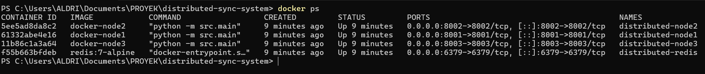

---

### 17.2 Raft Leader dan Follower

Screenshot berikut menunjukkan hasil leader election pada Raft. Terdapat satu node sebagai leader dan dua node sebagai follower.

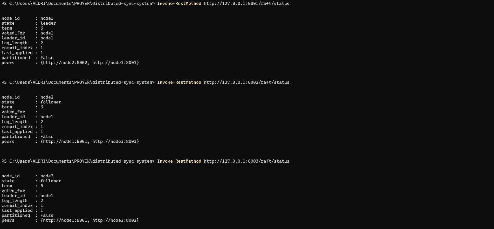

---

### 17.3 Shared Lock Berhasil

Screenshot berikut menunjukkan client-1 berhasil mengambil shared lock pada resource `docker-file-A`.

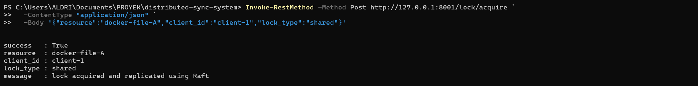

Screenshot berikut menunjukkan client-2 juga berhasil mengambil shared lock pada resource yang sama. Hal ini membuktikan bahwa shared lock dapat dimiliki oleh lebih dari satu client.

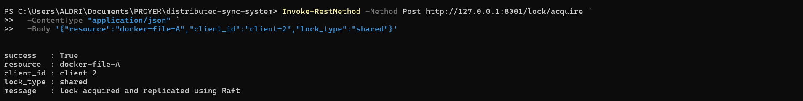

---

### 17.4 Exclusive Lock Conflict

Screenshot berikut menunjukkan bahwa exclusive lock ditolak ketika resource masih digunakan oleh shared lock.

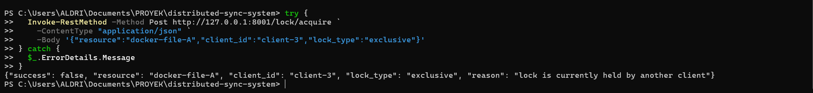

---

### 17.5 Deadlock Detection

Screenshot berikut menunjukkan response sistem ketika deadlock berhasil terdeteksi.

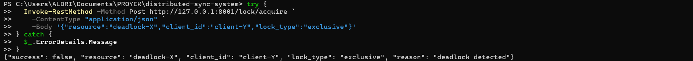

Screenshot berikut menunjukkan wait-for graph yang membentuk siklus antara `client-X` dan `client-Y`, serta status `deadlock_detected` bernilai `true`.

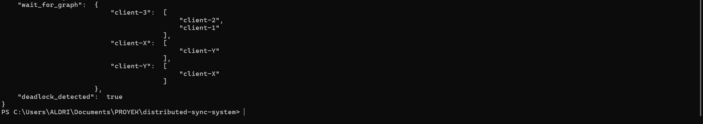

---

### 17.6 Network Partition Scenario

Screenshot berikut menunjukkan simulasi network partition. Pada skenario ini, `node1` berada dalam kondisi partitioned dan cluster memilih `node2` sebagai leader.

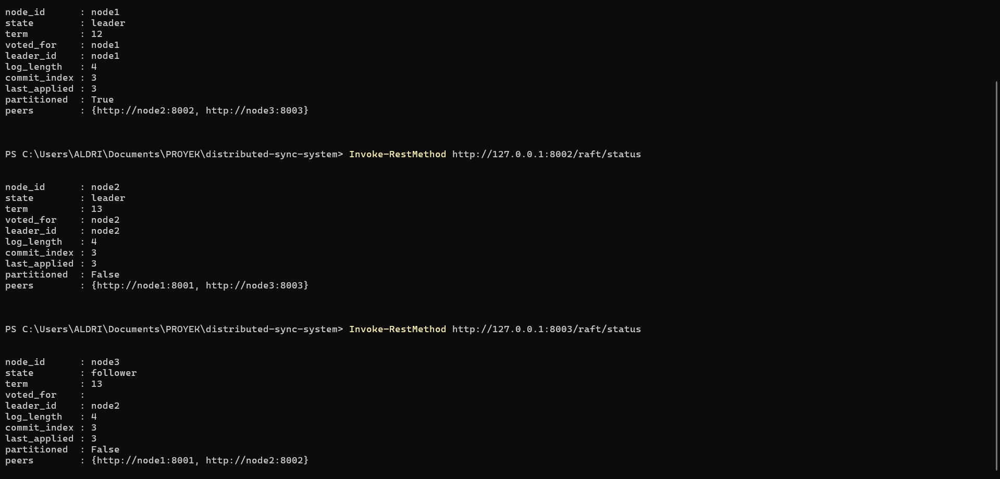

---

### 17.7 Distributed Queue Enqueue

Screenshot berikut menunjukkan message berhasil dimasukkan ke distributed queue.

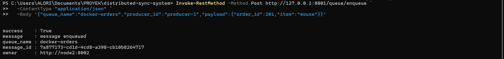

---

### 17.8 Distributed Queue Dequeue

Screenshot berikut menunjukkan consumer berhasil mengambil message dari queue.

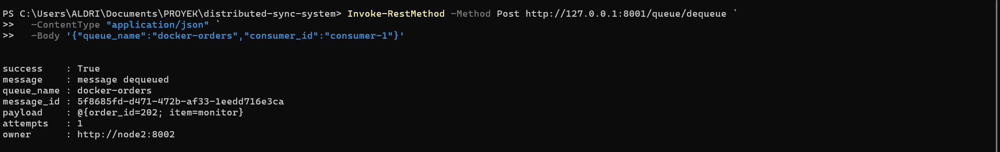

---

### 17.9 Distributed Queue ACK

Screenshot berikut menunjukkan message berhasil di-ACK setelah diproses oleh consumer.

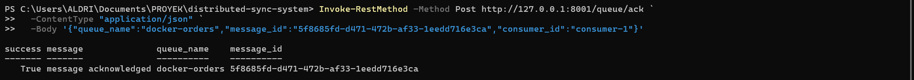

---

### 17.10 Cache Write Modified

Screenshot berikut menunjukkan data berhasil ditulis ke cache dengan state `M` atau Modified.

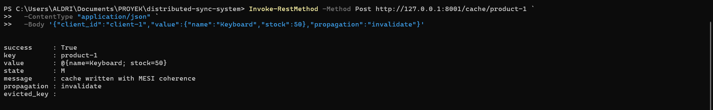

---

### 17.11 Cache Miss

Screenshot berikut menunjukkan cache miss. Data belum tersedia di cache lokal node2 sehingga data diambil dari Redis backing store.

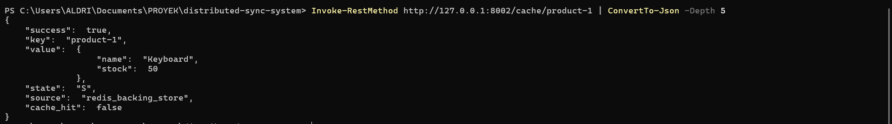

---

### 17.12 Cache Hit

Screenshot berikut menunjukkan cache hit. Data sudah tersedia di cache lokal node2 sehingga tidak perlu mengambil ulang dari Redis.

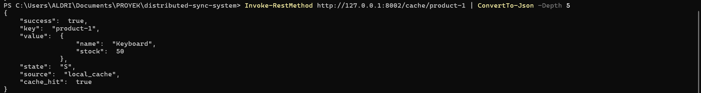

---

### 17.13 Cache Invalidation

Screenshot berikut menunjukkan cache invalidation. Setelah data diperbarui dari node1, cache pada node2 berubah menjadi state `I`.

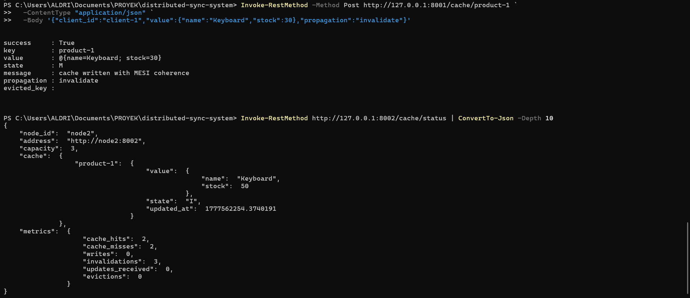

---

### 17.14 LRU Eviction

Screenshot berikut menunjukkan LRU eviction. Cache memiliki kapasitas 3 item, dan metrics `evictions` bertambah ketika jumlah data melebihi kapasitas.

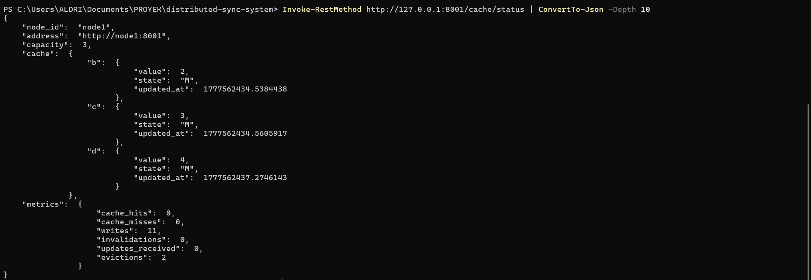

---

### 17.15 Benchmark 5 Users

Screenshot berikut menunjukkan hasil benchmark menggunakan Locust dengan 5 users.

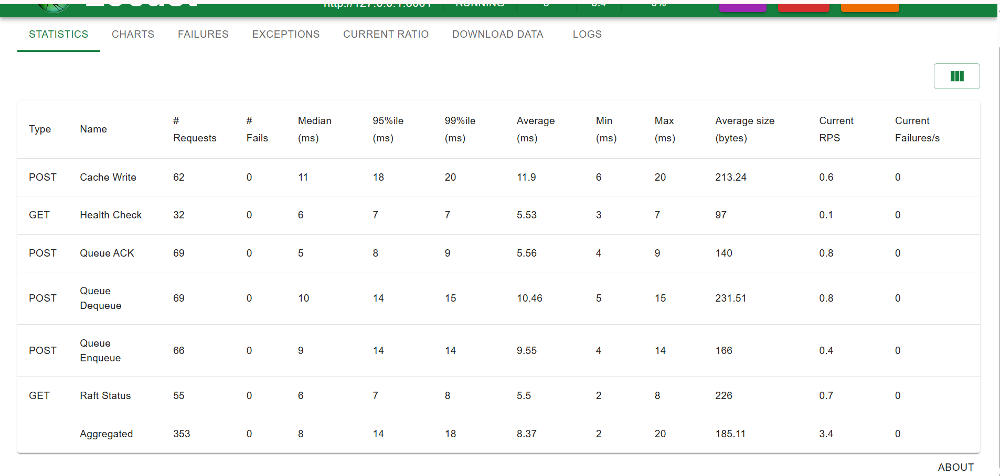

---

### 17.16 Benchmark 10 Users

Screenshot berikut menunjukkan hasil benchmark menggunakan Locust dengan 10 users.

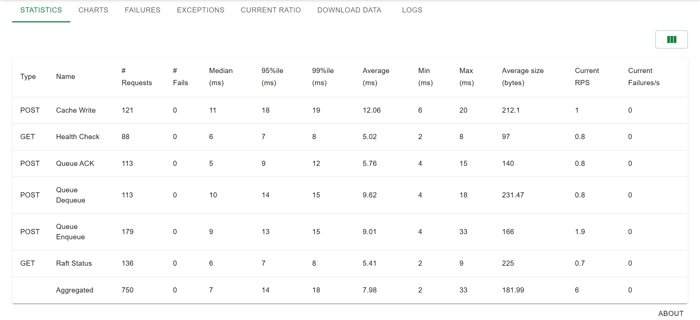

---

### 17.17 Benchmark 20 Users

Screenshot berikut menunjukkan hasil benchmark menggunakan Locust dengan 20 users.

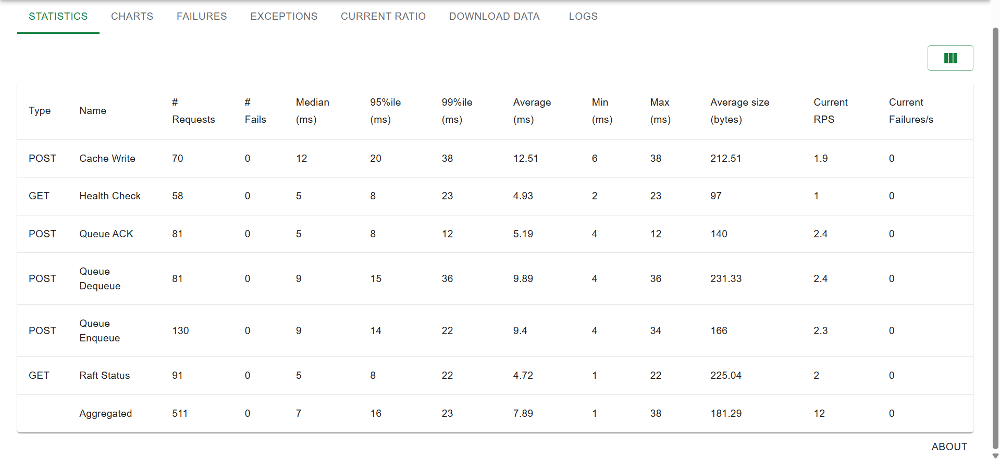

## 18. Catatan Akhir

Sistem ini merupakan simulasi distributed system untuk kebutuhan akademik. Implementasi Raft, queue, dan cache coherence dibuat untuk menunjukkan konsep utama distributed synchronization, bukan untuk penggunaan production.

Untuk pengembangan lebih lanjut, sistem dapat ditingkatkan dengan:

1. Implementasi Raft yang lebih lengkap.
2. Persistent log Raft ke storage.
3. Security seperti API key dan RBAC.
4. Monitoring dengan Prometheus dan Grafana.
5. Deployment multi-region.
6. Support scaling node secara otomatis.
